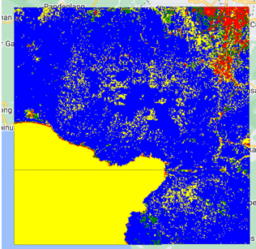

# 🗺️ Land Use / Land Cover Classification — Banten Province

Supervised classification of land use and land cover (LULC) in Banten Province
using Sentinel-2 multispectral imagery and machine learning on Google Earth Engine.

## ✨ Overview
This project classifies land surface into four categories:
- 🏙️ Urban / built-up area
- 🌿 Vegetation
- 💧 Water body
- 🟤 Bare land / open area

The classification is performed using a **Random Forest** algorithm
trained on manually digitized training samples from high-resolution imagery.

## 🖼️ Preview
<!-- Ganti dengan path screenshot setelah diupload ke repo -->

## 📦 Data
| Source | Type | Description |
|--------|------|-------------|
| Sentinel-2 (ESA Copernicus) | Multispectral raster | 10m resolution, cloud-filtered |
| Manual digitizing | Vector (training samples) | 4 classes, min. 50 points each |

## ⚙️ Methodology
1. Image preprocessing — cloud masking & median composite (2023)
2. Band selection — B2, B3, B4, B8 (Blue, Green, Red, NIR)
3. NDVI calculation as additional feature
4. Training sample digitizing (4 classes)
5. Random Forest classification (500 trees)
6. Accuracy assessment — confusion matrix & overall accuracy

## 🔗 Open in Google Earth Engine
[▶ Run this script on GEE](https://code.earthengine.google.com/ebb99e12a55db2b0935f6076aa5a0edb)

## 🛠️ Tools
- Google Earth Engine (JavaScript API)
- QGIS — training sample preparation
- Sentinel-2 L2A — surface reflectance product
